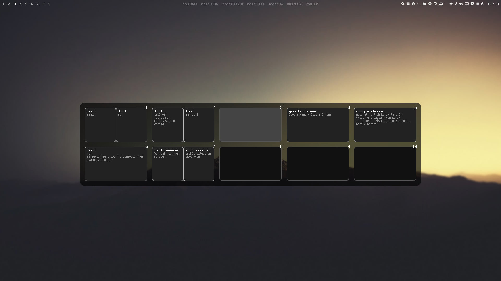

# sov — Sway Overview

[](https://github.com/milgra/sov/actions)


An overlay that shows schemas for all workspaces to make navigation in sway easier.



## Features ##

- no downscaled and confusing thumbnails, just crystal clear app names and titles
- layout schema makes workspace identification easier
- super lightweight   

## Installation

### Compiling from source

Install dependencies:

- wayland
- freetype2 \*
- wayland-protocols \*
- meson \*

\* _compile-time dependecy_

Run these commands:

```
git clone git@github.com:francma/sov.git
cd sov
meson build
ninja -C build
sudo ninja -C build install
```

### From packages

[](https://repology.org/project/sov/versions)

## Usage

Launch sov in a terminal, enter 0 to hide, 1 to show, 2 to quit sov, press return.

```
sov
```

### Usage with sway wm

Launch sov in the config connected to a named pipe but remove the named pipe first to avoid mkfifo errors.

```
exec rm -f /tmp/sovpipe && mkfifo /tmp/sovpipe && tail -f /tmp/sovpipe | sov

```

Set up your sway config so that on workspace button press and release it writes 1 and 0 into the pipe:

```
bindsym --no-repeat $mod+1 workspace number 1; exec "echo 1 > /tmp/sovpipe"
bindsym --no-repeat $mod+2 workspace number 2; exec "echo 1 > /tmp/sovpipe"
bindsym --no-repeat $mod+3 workspace number 3; exec "echo 1 > /tmp/sovpipe"
bindsym --no-repeat $mod+4 workspace number 4; exec "echo 1 > /tmp/sovpipe"
bindsym --no-repeat $mod+5 workspace number 5; exec "echo 1 > /tmp/sovpipe"
bindsym --no-repeat $mod+6 workspace number 6; exec "echo 1 > /tmp/sovpipe"
bindsym --no-repeat $mod+7 workspace number 7; exec "echo 1 > /tmp/sovpipe"
bindsym --no-repeat $mod+8 workspace number 8; exec "echo 1 > /tmp/sovpipe"
bindsym --no-repeat $mod+9 workspace number 9; exec "echo 1 > /tmp/sovpipe"
bindsym --no-repeat $mod+0 workspace number 10; exec "echo 1 > /tmp/sovpipe"

bindsym --release $mod+1 exec "echo 0 > /tmp/sovpipe"
bindsym --release $mod+2 exec "echo 0 > /tmp/sovpipe"
bindsym --release $mod+3 exec "echo 0 > /tmp/sovpipe"
bindsym --release $mod+4 exec "echo 0 > /tmp/sovpipe"
bindsym --release $mod+5 exec "echo 0 > /tmp/sovpipe"
bindsym --release $mod+6 exec "echo 0 > /tmp/sovpipe"
bindsym --release $mod+7 exec "echo 0 > /tmp/sovpipe"
bindsym --release $mod+8 exec "echo 0 > /tmp/sovpipe"
bindsym --release $mod+9 exec "echo 0 > /tmp/sovpipe"
bindsym --release $mod+0 exec "echo 0 > /tmp/sovpipe"

```

## Configuration ##

If you want to customize sov, copy /usr/share/sov/config to ~/.config/sov/config and edit it.

Possible keys :

**anchor** : where to display sov, top, bottom, left, right, center
**margin** : distance from edges if anchor is set
**timeout** : show timeout in millisecs
**gap** : distance between workspaces  
**columns** : thumbnail columns  
**ratio** : thumbnail to workspace ratio  
**font_face** : font face, use any string that is output by fc-list  
**text_margin_size** : margin size around text  
**text_margin_top_size** : margin top size over text  
**text_title_size** : title text size  
**text_title_color** : title text color  
**text_description_size** : description text size  
**text_description_color** : description text color  
**text_workspace_size** : workspace number text size  
**text_workspace_color** : workspace number text color  
**text_workspace_xshift** : workspace number x shift  
**text_workspace_yshift** : workspace number y shift  
**border_color** : border color  
**background_color** : background color  
**background_color_focused** : focused background color  
**window_color** : window color
**empty_color** :  empty thumb color
**empty_frame_color** : empty thumb border

## Contribution/Development ##

Feel free to push fixes/improvements.

Please follow these guidelines :

- use clang format before commiting/after file save
- use zen_core functions and containers and memory handling
- make sure that the app is leak free. if you run the dev build it automagically checks for leaks on exit on two levels (zc_memory and clang address sanitizer ) and prints leaks
- always run all tests before push

Creating a debug build :

```
CC=clang meson build --buildtype=debug -Db_sanitize=address -Db_lundef=false
```

## Donate ##

paypal : [https://paypal.me/milgra](https://paypal.me/milgra) / patreon : [https://www.patreon.com/milgra](https://www.patreon.com/milgra) / bitcoin : 37cSZoyQckihNvy939AgwBNCiutUVN82du  

## License ##

MIT, see [LICENSE](/LICENSE).

## TODO/BUGS ##

crash on empty workspace
crash on feh
fix test and release workflows